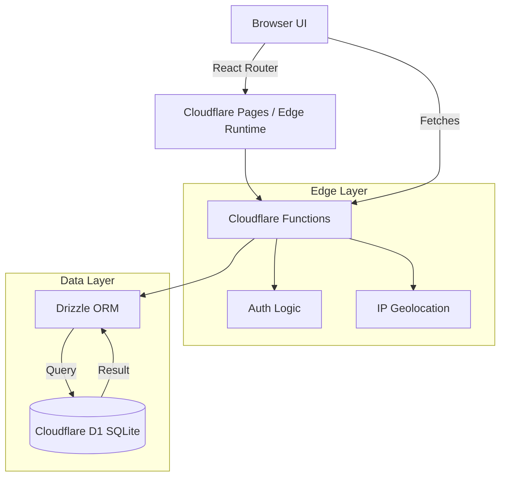

# HotChair v6.6.6
Distributed Attendance Verification System

## Stack
- **Framework**: Vite + React 19
- **Database**: Cloudflare D1 (SQLite) with Drizzle ORM
- **Runtime**: Cloudflare Pages
- **Styling**: Tailwind CSS v4

## Arquitectura del Sistema


## Setup

### 1. Install Dependencies
```bash
npm install
```

### 2. Database Setup & Migration
The local development environment uses `better-sqlite3` to simulate D1.
You need to generate the migration files and apply them.

```bash
# Generate SQL from schema
npm run db:generate

# Apply migration locally (will create .wrangler/state/... sqlite file)
npm run db:migrate -- --file=drizzle/0000_xxxx.sql 
# Note: Locate the actual filename in drizzle/ folder after generation
```

*Tip: For the very first run, if the migration command complains about the database not existing, `wrangler` usually creates it automatically with `--local`.*

### 3. Seed Users
You need users to log in. Run a manual SQL command or use wrangler to insert users.

```bash
npx wrangler d1 execute hotchair-db --local --command "INSERT INTO users (id, code, pin, name) VALUES ('u1', 'EMP001', '1234', 'Alice'), ('u2', 'EMP002', '1234', 'Bob');"
```

### 4. Run Development Server
```bash
npm run dev
```
Access at [http://localhost:5173](http://localhost:5173).

## Deployment
1. Connect repository to Cloudflare Pages.
2. Build command: `npm run build`
3. Output directory: `dist`
4. **Crucial**: Go to Settings -> Functions -> D1 Database Bindings and bind `DB` to your `hotchair-db`.

## Features
- **AULA**: View who is Present/Remote.
- **COMEDOR**: View who is currently at lunch.
- **Verification**: Vote to confirm someone is present (gamified trust).
